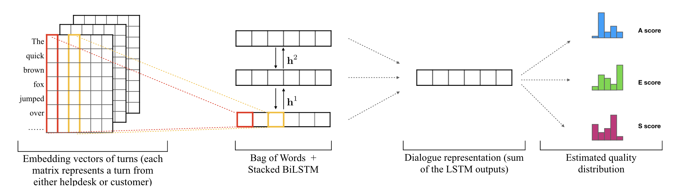
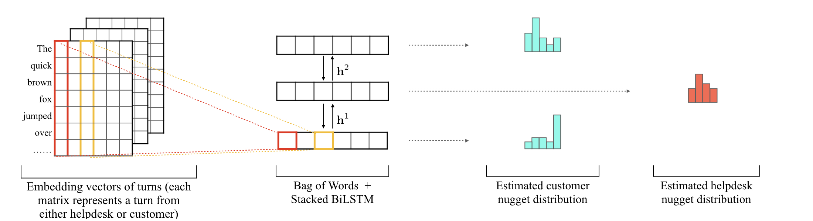

This repo is a LSTM+BoW baseline model for [Nugget Detection (ND) and Dialogue Quality (DQ) subtasks of NTCIR 14 - Short Text Conversation (STC3).](https://sakai-lab.github.io/stc3-dataset/)


### Dialogue Quality  Model

Each Dialogue turn is represented as a N x D matrix where N is the number of tokens and D is the embedding dimensionality.  To convert each turn matrix into a vector, we simply apply Bog of Words, which is taking the sum of each word vectors. Then, stacked bidirectional LSTMs are empoyed to encode turn vectors to obtain the dialogue representation. Finally, the dialogue representation are feed into connected layers to estimate quality score distributions.

A-score: Accomplishment Score (2, 1, 0, -1, -2).

E-score: Efficienty Score (2, 1, 0, -1, -2).

S-Score: Satisfcation score (2, 1, 0, -1, -2).



### Nugget Detection Model

Nugget detection baseline model is similar to the model abolve, but we predict the nugget distrubtion for  customer turns and helpdesk turns.

- Customer turn nugget types: Trigger Nugget (CNUG0), Not A Nugget (CNaN), Regular Nugget (CNUG), and Goal Nugget (CNUG*)

- Helpdesk turn nugget types: Not A Nugget (HNaN), Regular Nugget (HNUG), and Goal Nugget (HNUG*)




We aim to provide a start point for STC3 participants and researchers who are interested in the STC3 NDDQ dataset. Please feel free to fork this repo and modify `model.py` to implement your own models. 


# Get Started
### Install

Recommended environment: 

- python>=3.6
- tensorflow-gpu>=1.10

```bash
# Clone this repo, "--recursive" is essential
git clone  https://github.com/sakai-lab/stc3-baseline.git --recursive

# Install dependencies
pip install -r requirements.txt

# download spacy english corpus
python -m spacy download en  
```
### Train all tasks
This command will train 4 models for both nugget detection and dialogue quality tasks for both Chinese and English training dataset.
In addition, the prediction for the test set will be placed in `./output`
```bash
./train_all.sh
```

### Register your team

Please register your team name so we can know who submitted the prediction file. 
Please replace ` "YOUR_TEAM_NAME"` with your  team name.
```bash
python stc3dataset/data/create_team.py --team_name "YOUR_TEAM_NAME" --team_info "XXYY University"
```


### Submit
This command will submit your prediction files in `./output` and display evaluation scores.
Please replace ` "YOUR_TEAM_NAME"` with your own registered team name.

```bash
./submit_all.sh "YOUR_TEAM_NAME"
```
Example output: 
```bash
$ ./submit_all.sh "Test Team"
TEAM NAME: Test Team
Metrics for: nugget chinese
output/nugget_chinese_test_submission.json
{'nugget': {'jsd': 0.024747137566657945, 'rnss': 0.0948602959911484}}

Metrics for: nugget english
output/nugget_english_test_submission.json
{'nugget': {'jsd': 0.03307433582863113, 'rnss': 0.11364764109070319}}

Metrics for: quality chinese
output/quality_chinese_test_submission.json
{   'quality': {   'nmd': {   'A': 0.08409080275695541,
                              'E': 0.08058990451194595,
                              'S': 0.07832002716510955},
                   'rsnod': {   'A': 0.12690221741404012,
                                'E': 0.12455801523445159,
                                'S': 0.12469044991148064}}}

Metrics for: quality english
output/quality_english_test_submission.json
{   'quality': {   'nmd': {   'A': 0.1290874171824946,
                              'E': 0.10796502151307355,
                              'S': 0.11588490421256939},
                   'rsnod': {   'A': 0.1764054498407714,
                                'E': 0.14970474316561103,
                                'S': 0.16815954764653537}}}

```
Note that the scores showed are calculated based on only a part of test set to prevent overfitting the test set.
The whole test set will be used only in the final evaluation stage of [NTCIR14-STC3](https://sakai-lab.github.io/stc3-dataset/).

# Commands

### Train a single task
```bash
# Train Nugget Detection with English training dataset
python train.py \
    --task nugget \
    --language english \
    --learning-rate 1e-3 \
    --batch-size 128

```
By default, checkpoints will be stored in `./checkpoint`, and logs for tensorboard will be written to `./log`.
After training, the prediction file for test set will be written to `./output`.

For more adjustable hyper-parameters, please check `flags.py`.


### Submit a single task
To submit your prediction to our online judge system for public evaluation scores, run
```bash
python stc3dataset/data/submit.py \
    --team_name "YOUR_TEAM_NAME" \
    --language english \
    -s ./output/nugget_english_test_submission.json
```
Note: Please replace ` "YOUR_TEAM_NAME"` with your own registered team name.

### Loading checkpoint and generate a prediction file
You may use the following command to generate a prediction for test set by loading a trained model checkpoint.
The prediction file will be put in `./output` by default.

```bash
python train.py \
    --task nugget \
    --language english \
    --resume-dir ./checkpoint/.... \
    --infer-test True \
    --output-dir ./output
```